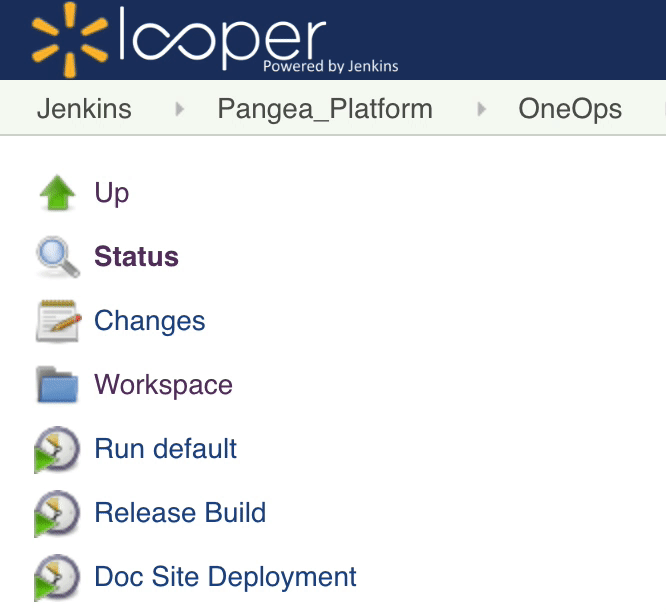

 Infoblox Java Client
----------
[][build-job] [![changelog][cl-svg]][cl-url] [![javadoc][javadoc-svg]][javadoc-url]  

A pure java API for Infoblox DNS appliance.

Download
--------

Download [the latest JAR][1] or grab via Maven:
```xml
<dependency>
   <groupId>com.oneops</groupId>
   <artifactId>infoblox-java</artifactId>
   <version>1.3.5</version>
</dependency>
```
> To see all versions, go [here][0]

## Examples

#### Initializing Infoblox Client

```java
InfobloxClient client = InfobloxClient.builder()
            .endPoint("Infoblox Host")
            .userName("Infoblox User")
            .password("Infoblox Password")
            .ttl(60)
            .tlsVerify(false)
            .build();
```
> Default WAPI version is <b>v2.5</b>

<details>
 <summary>Walmart Infoblox Provider</summary>

   A new `InfobloxClientProvider` class has been provided to create 
   `InfobloxClient` transparently based on the `FQDN`. This will be make use of a `/secrets/infoblox-conf.json` config file to get all the infoblox endpoint configurations. To get a client (cached) for supported domain, 

   ```java 
   String fqdn = "test.us.walmart.net";
   String ip = "10.11.12.13";

   InfobloxClient client = InfobloxClientProvider.forDomain(fqdn);
   ARec aRec = client.createARec(fqdn, ip);
   ```
</details><br/>

<details open>
 <summary>TLS config</summary>

  - For TLS verification, set the CA truststore using [trustStore()][2] & [trustStorePassword()][3] methods.
  - Truststore should be of type [PKCS#12][4] format. 
  - For loading the Truststore from classpath use, `classpath:/<your/truststore/path>.p12`
  - To enable http debugging for troubleshooting, set [.debug(true)][5] to the [InfobloxClient.builder()][6]
</details><br/>

#### **A** Record

```java
String fqdn = "test.xyz.com";
String ip = "10.11.12.13";

// CRUD operations
ARec aRec = client.createARec(fqdn, ip);
List<ARec> rec = client.getARec(fqdn);
List<ARec> aRecs = client.getARec(fqdn, ip);
List<ARec> modifedARec = client.modifyARec(fqdn, newFqdn);
List<String> delARec = client.deleteARec(fqdn);
```
#### **AAAA** Record

```java
String fqdn = "test.xyz.com";
String ipv6 = "fe80:0:0:0:f0ea:f6ff:fd97:5d51";

// CRUD operations
AAAA newAAAARec = client.createAAAARec(fqdn, ipv6);
List<AAAA> aaaaRec = client.getAAAARec(fqdn);
List<AAAA> modAAAARec = client.modifyAAAARec(fqdn, newFqdn);
List<String> delAAAARec = client.deleteAAAARec(fqdn);
```

#### **CNAME** Record

```java
String canonicalName = "test.xyz.com";
String alias = "app.xyz.com";

// CRUD operations
CNAME cname = client.createCNameRec(alias, canonicalName);
List<CNAME> rec = client.getCNameRec(alias);
List<CNAME> modCName = client.modifyCNameRec(alias, newAlias);
List<String> delCName = client.deleteCNameRec(alias);
```

Refer [JavaDocs][javadoc-url] for all record types (**MX, PTR, SRV, TXT, NS, Zone** etc) APIs

## Building

 For doing the release build, go to [build job][build-job] and click `Release Build`
 
 
  

## Testing

Set the following env variables and run `./mvnw clean test` to execute the unit tests.

```bash
$ ssh -v user@any-prod-server -L 8888:infoblox-api.walmart.com:443
$ export iba_host=localhost:8888
  export iba_user=<Infoblox Username>
  export iba_password=<Infoblox Password>
  export iba_domain=prod.walmart.com
```

> Note: `infoblox-api.walmart.com` may not be directly accessible from your test machine. 
> As a workaround use SSH tunneling `ssh -v user@any-prod-server -L 8888:infoblox-api.walmart.com:443` 
> and use `localhost` as `iba_host`.

## Dependencies

 - [Retrofit](https://github.com/square/retrofit/)
 - [OkHttp](https://github.com/square/okhttp)
 - [Moshi](https://github.com/square/Moshi/)
 - [Kotlin](https://kotlinlang.org/)

      
License
-------

    Licensed under the Apache License, Version 2.0 (the "License");
    you may not use this file except in compliance with the License.
    You may obtain a copy of the License at

       http://www.apache.org/licenses/LICENSE-2.0

    Unless required by applicable law or agreed to in writing, software
    distributed under the License is distributed on an "AS IS" BASIS,
    WITHOUT WARRANTIES OR CONDITIONS OF ANY KIND, either express or implied.
    See the License for the specific language governing permissions and
    limitations under the License.


<!-- Badges -->

[0]: https://repository.walmart.com/content/groups/public/com/oneops/infoblox-java/
[1]: https://repository.walmart.com/nexus/service/local/artifact/maven/redirect?g=com.oneops&a=infoblox-java&v=LATEST&e=jar&r=pangaea_releases&c=
[2]: https://gecgithub01.walmart.com/pages/oneops/infoblox-java/javadocs/com/oneops/infoblox/InfobloxClient.Builder.html#trustStore-java.lang.String-
[3]: https://gecgithub01.walmart.com/pages/oneops/infoblox-java/javadocs/com/oneops/infoblox/InfobloxClient.Builder.html#trustStorePassword-java.lang.String-
[4]: https://en.wikipedia.org/wiki/PKCS_12
[5]: https://gecgithub01.walmart.com/pages/oneops/infoblox-java/javadocs/com/oneops/infoblox/InfobloxClient.Builder.html#debug-boolean-
[6]: https://gecgithub01.walmart.com/pages/oneops/infoblox-java/javadocs/com/oneops/infoblox/InfobloxClient.Builder.html

[build-job]: https://ci.walmart.com/job/Pangea_Platform/job/OneOps/job/infoblox-java/

[cl-url]: https://gecgithub01.walmart.com/oneops/infoblox-java/blob/master/CHANGELOG.md
[cl-svg]: https://img.shields.io/badge/change--log-latest-green.svg?style=flat-square

[javadoc-url]: https://gecgithub01.walmart.com/pages/oneops/infoblox-java/javadocs/
[javadoc-svg]: https://img.shields.io/badge/api--doc-latest-cyan.svg?style=flat-square

